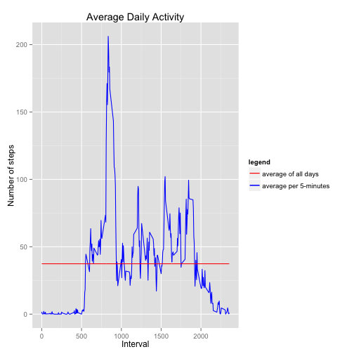

## Loading and preprocessing the data

```r
library(scales)
library(ggplot2)
library(plyr)
if (!file.exists("data")){
        dir.create("data")
}
activity <- read.csv("./data/activity.csv")
str(activity)
```

```
## 'data.frame':	17568 obs. of  3 variables:
##  $ steps   : int  NA NA NA NA NA NA NA NA NA NA ...
##  $ date    : Factor w/ 61 levels "2012-10-01","2012-10-02",..: 1 1 1 1 1 1 1 1 1 1 ...
##  $ interval: int  0 5 10 15 20 25 30 35 40 45 ...
```

```r
summary(activity)
```

```
##      steps               date          interval   
##  Min.   :  0.0   2012-10-01:  288   Min.   :   0  
##  1st Qu.:  0.0   2012-10-02:  288   1st Qu.: 589  
##  Median :  0.0   2012-10-03:  288   Median :1178  
##  Mean   : 37.4   2012-10-04:  288   Mean   :1178  
##  3rd Qu.: 12.0   2012-10-05:  288   3rd Qu.:1766  
##  Max.   :806.0   2012-10-06:  288   Max.   :2355  
##  NA's   :2304    (Other)   :15840
```

```r
activity$steps  <-  as.numeric(activity$steps);
activity$interval  <- as.numeric(activity$interval);
activity$date  <- as.Date(strptime(activity$date, format = "%Y-%m-%d"))
```

## What is mean total number of steps taken per day?

```r
activityDay  <- aggregate(steps ~ date, activity, sum)
ggplot(activityDay, aes(x=steps)) + 
        geom_histogram(binwidth = 1500) +
        labs(title="histogram of the total number of steps taken each day") 
```

 

```r
mean(activityDay$steps,na.rm=T)
```

```
## [1] 10766
```

```r
median(activityDay$steps,na.rm=T)
```

```
## [1] 10765
```

## What is the average daily activity pattern?

```r
fiveMinutesData  <- aggregate(steps ~ interval, activity, mean)
ggplot(fiveMinutesData, aes(x = interval, y = steps, color = "red")) + 
        geom_line() +
        geom_line(aes(y=mean(fiveMinutesData$steps, na.rm=T), color="blue")) +
        scale_colour_manual("legend", values = c("red","blue"), labels = c("average of all days", "average per 5-minutes")) +
        labs(title="Average Daily Activity", x="Interval", y="Number of steps")
```

 

```r
interval_max_step <- fiveMinutesData[ fiveMinutesData$steps == max(fiveMinutesData$steps),][[1]]
```
The 835  5-minute interval, on average across all the days in the dataset contains the maximum number of steps

## Imputing missing values
My strategy for filling in all of the missing values : mean for the same 5-minute interval identifier

```r
# Calculate and report the total number of missing values 
sapply(activity, function(x) sum(is.na(x)))
```

```
##    steps     date interval 
##     2304        0        0
```

```r
activityWithoutNA <- ddply(activity, .(interval), function(df) {
        df$steps[is.na(df$steps)] <- mean(df$steps, na.rm=TRUE); 
        return(df)
        })
activityDay  <- aggregate(steps ~ date, activityWithoutNA, sum)
ggplot(activityDay, aes(x=steps)) + 
        geom_histogram(binwidth = 1500) +
        labs(title="histogram of the total number of steps taken each day") 
```

 

```r
mean(activityDay$steps,na.rm=T)
```

```
## [1] 10766
```

```r
median(activityDay$steps,na.rm=T)
```

```
## [1] 10766
```

```r
summary(activityWithoutNA)
```

```
##      steps            date               interval   
##  Min.   :  0.0   Min.   :2012-10-01   Min.   :   0  
##  1st Qu.:  0.0   1st Qu.:2012-10-16   1st Qu.: 589  
##  Median :  0.0   Median :2012-10-31   Median :1178  
##  Mean   : 37.4   Mean   :2012-10-31   Mean   :1178  
##  3rd Qu.: 27.0   3rd Qu.:2012-11-15   3rd Qu.:1766  
##  Max.   :806.0   Max.   :2012-11-30   Max.   :2355
```
the main is the same while the median differs slightly. I don't observe a visible impact of imputing missing data on the estimates of the total daily number of steps

## Are there differences in activity patterns between weekdays and weekends?

```r
weekday  <- weekdays(activity$date)
weekday[ !weekday %in% c("Samedi", "Dimanche")]  <- "weekday"
weekday[ weekday %in% c("Samedi", "Dimanche")]  <- "weekend"
activity$weekday  <- as.factor(weekday)

activityWeekDay  <- aggregate(steps ~ interval + weekday , activity, mean)
ggplot(activityWeekDay, aes(x = interval, y = steps)) + 
        geom_line(color = "blue") + 
        facet_wrap(~weekday, nrow = 2, ncol = 1) + 
        labs(title="Differences in activity patterns between weekdays and weekends", x = "Interval", y = "Number of steps") + 
        theme_bw()
```

 
